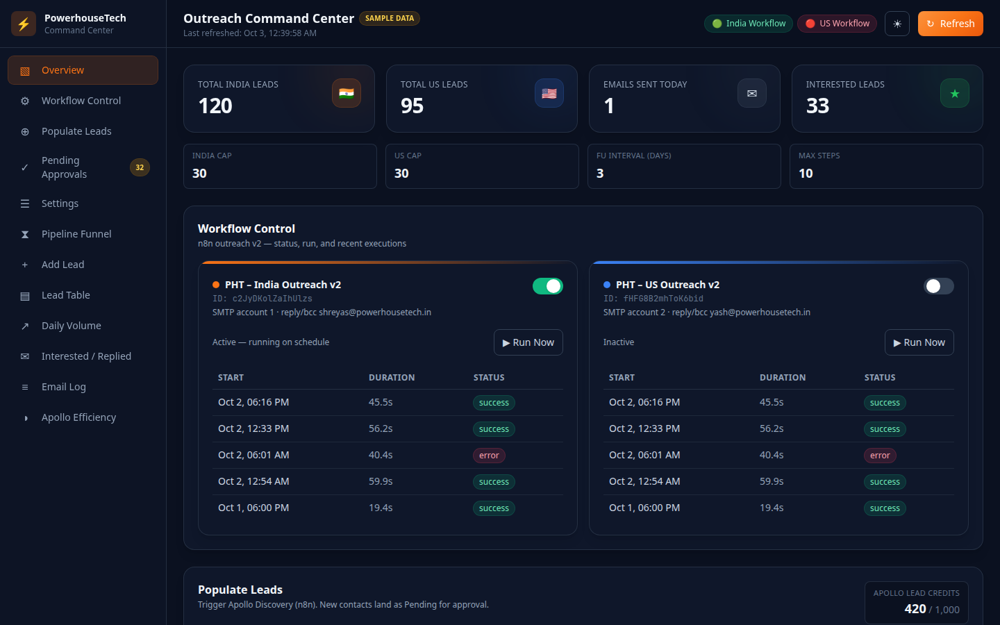
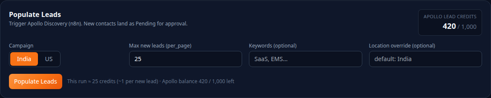
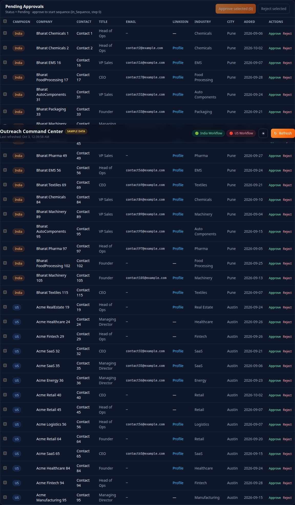
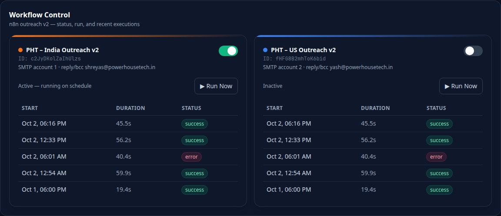
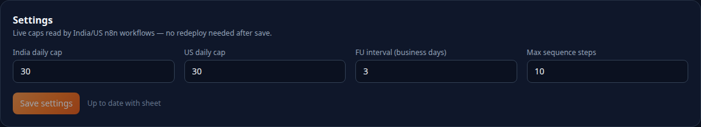
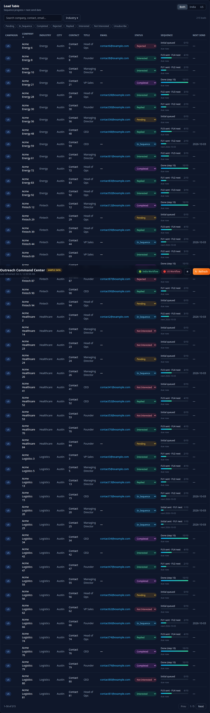

# Outreach Command Center — Admin Guide

**Portal:** https://powerhousetech.in/command-center  
**Access:** Google admin sign-in (`shreyas@` / `yash@`powerhousetech.in)  
**Updated:** 2026-10-03

Admin-only ops: populate → approve → send → monitor. No developer setup.

## 1. Daily loop

1. **Populate** — Apollo discovery for India or US  
2. **Approve** — Pending → In_Sequence (or Reject)  
3. **Schedule / Run Now** — India Mon–Sat 8:30 IST · US Mon–Fri 10:00 ET  
4. **Check** Email Log + workflow executions  

| Status | Meaning | Your action |
|---|---|---|
| Pending | Found by Apollo | Approve or Reject |
| In_Sequence | In email cadence | None |
| Completed | Finished sequence | None / restart |
| Rejected | Excluded (audit) | None |

## 2. Populate Leads

| Field | What to set |
|---|---|
| Campaign | India or US (required) |
| Max new leads | Default 25 · max 100 · ~1 credit each |
| Keywords | Optional |
| Location override | Optional city; blank = country default |

Confirm credits → Proceed. Rows land as **Pending**.

## 3. Pending Approvals

- **Approve** → In_Sequence, step 0, blank next-send (due next run)  
- **Reject** → Rejected (kept for audit)  
- Bulk select supported  

## 4. Workflow Control & Run Now

| Campaign | Schedule | From / reply |
|---|---|---|
| India | Mon–Sat 8:30 AM IST | shreyas@infopowerhousetech.in |
| US | Mon–Fri 10:00 AM ET | yash@powerhousetech.in |

Toggle Active to pause schedule. Run Now confirms, then sends up to the daily cap.

## 5. Settings

| Key | Default | Effect |
|---|---|---|
| India_Daily_Cap | 30 | Max India emails / run |
| US_Daily_Cap | 30 | Max US emails / run |
| FU_Interval_Days | 3 | Business days between FUs |
| Max_Sequence_Steps | 10 | Then → Completed |

Set a Daily_Cap to **0** to pause that campaign for a day.

## 6. Lead Table

| Step | Meaning |
|---|---|
| 0 | Initial not sent |
| 1 | Initial sent · FU1 next |
| 2+ | FU in progress |
| = max | Completed |

Empty Next_Send_Date on In_Sequence = due now.

## 7. Add known contact

Portal **Add Lead**, or sheet row with Status=`In_Sequence`, Sequence_Step=`0`, Next_Send_Date blank. Use Pending if you want approval first.

## 8. Monitoring & fixes

| Where | Check |
|---|---|
| Email Log | Sent / Failed + type |
| Lead Table | Status, step, next date |
| Workflow cards | Recent executions |
| Overview caps | Daily caps before a big run |

| Symptom | Fix |
|---|---|
| 0 emails | Due dates / raise Daily_Cap |
| Workflow error | Re-auth n8n credentials (ops) |
| Lead missing | Fix Status typo in sheet |
| Apollo 0 people | Clear city override; check credits |
| Spam | Lower Daily_Cap |

## 9. Mid-week controls

| Goal | How |
|---|---|
| Change volume | Edit Daily_Cap |
| Pause campaign | Daily_Cap = 0 |
| Pause one lead | Status → Rejected |
| Restart lead | In_Sequence · step 0 · next blank |
| Wider FU gap | Raise FU_Interval_Days |
| Remove lead | Delete sheet row |

---

Sheet tabs: India Leads · US Leads · Email Log · Settings  
Do not rotate `N8N_API_KEY` / `ADMIN_EMAILS` (other products).
