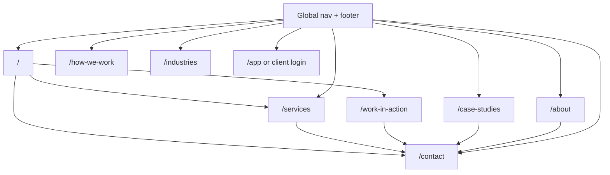

# Website Expansion for Client Acquisition - Plan

## Goal Capsule

**Objective:** Expand powerhousetech.in from a single long landing page into a multi-page, conversion-focused service firm website that attracts international clients, showcases proof (including two Loom demo videos), and surfaces direct contact with Shreyas and Yash — while preserving the existing client workspace behind a clear entry point.

**Product authority:** This brainstorm defines site structure, content priorities, contact details, and v1 scope. Implementation mechanics (static vs Next.js, form backend) are deferred to planning.

**Open blockers:**
- Loom video URLs are not yet recorded (placeholders required until ready).
- Calendly embed on Contact page for Shreyas (user confirmed v1) — Yash may share link later or stay phone/email.
- Whether case studies launch anonymized or wait for named client approval.
- Yash's full name / title for Contact cards not confirmed (listed as "Yash" only).

## Product Contract

### Summary

Evolve Powerhouse’s public site to match the Lovable reference’s **multi-page information architecture** (Home, Services, How we work, Industries, Case studies, About, Contact) and add a dedicated **“See it in action”** surface for two sample-automation Loom videos. Replace generic hello@ contact with **named partners** (Shreyas and Yash) including email and phone. Layer in lead-capture and trust features that help international prospects self-qualify before a discovery call.

### Problem Frame

The current production site (`index.html`) is a ~6k-line single-page app: marketing sections use in-page anchors, while a Firebase Google-sign-in workspace (NCE converter, compliance reminders, working papers) lives in the same file. That made sense for a CA product; it underserves a **service firm** selling to international businesses. Prospects need depth (services, process, proof, team), quick credibility (demos, metrics, case patterns), and low-friction ways to reach a human — without wading through product login flows.

The Lovable prototype already models the right **site shape** (real routes, richer Services page with six practices, About with origin story and principles). The gap is implementing that shape on the live stack with Powerhouse brand colors, real contact details, Loom slots, and features that convert visitors into discovery calls.

### Key Decisions

- **Multi-page marketing site, not one scroll.** Primary nav links route to distinct pages (or clean URL paths), aligned with Lovable: Services, How we work, Industries, Case studies, About, plus Contact/Book a call.
- **Loom demos are first-class.** Two placeholder-ready embed slots on Home (teaser) and a dedicated **Work in action** section/page; each slot includes title, one-line outcome, and “what you’ll see” bullets until videos exist.
- **Named contacts are canonical.** Public contact surfaces list Shreyas Sinha and Yash with their emails and phones; generic inboxes are secondary or removed from primary CTAs.
- **Service positioning over product login.** Primary CTAs are Book a discovery call / Start a project; Client login remains available but de-emphasized for the workspace app.
- **Brand colors stay Powerhouse** (ink `#16161A`, indigo `#424FD1`, ivory surfaces) — Lovable layout and typography direction, not Lovable’s cyan/navy palette.
- **Phased delivery.** v1 ships IA + core pages + Loom placeholders + contact; v1.1 adds lead magnets and interactive tools; v2 adds blog, booking embed, and deeper case study library.

### Actors

| Actor | Goal on site |
|-------|----------------|
| International ops/finance leader | Understand if Powerhouse can automate their messy workflows; see proof; book a call |
| Founder / GM (SMB) | Quick scan of services, ROI signals, demo videos; reach a person directly |
| Prospect comparing agencies | Compare service model vs SaaS; read process and principles |
| Existing workspace user | Find Client login without marketing noise |
| Shreyas / Yash | Receive qualified inbound via email, phone, or form with context |

### Key Flows

**F1 — Discover and convert (cold visitor)**  
Land on Home → scan hero + stats + trust bar → watch Loom teaser (or skip) → read Services / How we work → view Case studies or Work in action → Contact page with Shreyas/Yash → email or call.

**F2 — Demo-led conversion**  
Home or Work in action → play Loom video 1 or 2 → related “typical engagement” CTA → Book discovery call pre-filled with demo topic (subject line or form field).

**F3 — Deep service evaluation**  
Services page → pick practice (e.g. Finance & reporting) → see bullet capabilities + example outcomes → Industries cross-link → Start a project.

**F4 — Existing client**  
Footer or nav → Client login → existing Firebase workspace (unchanged behavior).

### Site map (target)

### Lovable reference audit (multi-page, not one scroll)

The Lovable prototype is a **real multi-route site**:

| Route | Purpose | Key content to port |
|-------|---------|---------------------|
| `/` | Home | Hero, service teasers, 4-step process, metrics, why-service, CTA |
| `/services` | Deep services | Six practices, 4 bullets each, "top 3 time-sinks" CTA |
| `/how-we-work` | Process | W1 Discover → W2 Design → W3–8 Build → Ongoing Run + deliverables |
| `/case-studies` | Proof | Problem → automation → outcome stories |
| `/about` | Trust | CA-origin → global pivot + 4 principles |
| Nav | Global | Book a call on every page |

**Gap vs production:** `index.html` is one file (~6k lines) with marketing anchors + Firebase workspace. Lovable's `/services` and `/how-we-work` depth is not on live site yet.

### Recommended build approaches

| Approach | Summary | Best when |
|----------|---------|-----------|
| **A — Static multi-HTML** *(recommended v1)* | `services.html`, `contact.html`, etc. + shared CSS from current home | Ship in days on Netlify as-is |
| **B — Next.js marketing** | Use `src/` app, separate deploy from workspace | Frequent content + blog later |
| **C — Lovable export + reskin** | Export Lovable, swap to Powerhouse palette + real contacts | Fastest visual clone; harder to merge workspace |

### Ideation catalog (prioritized)

#### Tier 1 — v1 (ship with multi-page launch)

| Idea | Why it attracts clients |
|------|-------------------------|
| **Dedicated Contact page** | Shreyas + Yash cards: photo, role, email, click-to-call phone, timezone note (IST, serving global) |
| **Work in action / Demos page** | Two Loom embed placeholders with outcome headlines; strongest proof for service firms |
| **Home Loom teaser strip** | “Watch a 3-min walkthrough” above the fold or after hero — reduces bounce |
| **Services page (6 practices)** | Match Lovable depth: Operations, Sales & CRM, Finance, Support & success, Custom AI, Data & integrations — each with 4 capability bullets |
| **How we work page** | Expand 4-step model (Discover / Design / Build / Run) with deliverables per phase and timeline expectations |
| **About page** | Origin story (CA → global service), principles, small-team positioning, full team roster optional |
| **Case studies index** | 2–3 anonymized stories: problem → automation → hours saved; link to relevant Loom when available |
| **Industries page** | International B2B, E-commerce, SaaS, Professional services — sector pain points + example automations |
| **Global nav + footer** | Consistent across pages; Book a call primary; Client login secondary |
| **Sticky mobile CTA** | Book a discovery call |
| **Metrics band** | 1,200+ hrs, 92% fewer errors, 3–5× ROI (as on current home) |
| **Why service, not SaaS** | Differentiator block on Home or About |
| **Integration logo marquee** | Slack, Notion, HubSpot, Google, Microsoft, Airtable — “we build in your stack” |

#### Tier 2 — v1.1 (quick follow-ups)

| Idea | Why |
|------|-----|
| **FAQ page** | Pricing shape, engagement length, ownership, security, time zones |
| **Simple contact form** | Name, company, country, top 3 pain points → emails both partners (Netlify Forms or Supabase) |
| **Calendly embed** | Reduce back-and-forth for discovery calls |
| **WhatsApp click-to-chat** | Strong for India-origin firm serving global; optional second line per contact |
| **Automation readiness checklist (PDF)** | Email-gated lead magnet |
| **ROI / hours calculator** | Interactive: team size × hours/week on manual task → estimated savings |
| **“Send us your top 3 time-sinks”** micro-form | Low-friction lead capture on Services page |
| **Security & data handling page** | Enterprise trust for international clients |
| **Testimonial quotes** | Even 2–3 founder-beta quotes until named clients approve |
| **Automation readiness quiz** | 5 questions → "you're a strong fit" + CTA (no backend — result in-page) |
| **Before/after workflow diagrams** | Static SVG per case study — visual proof without video |
| **Pricing shape page** | Engagement bands: Discovery week / Build sprint / Run retainer (not fixed pricing) |

#### Tier 3 — v2 (compound growth)

| Idea | Why |
|------|-----|
| **Blog / Insights** | SEO for “workflow automation for [industry]” |
| **Newsletter** | Nurture leads not ready to buy |
| **Detailed case study templates** | Before/after workflow diagrams per engagement |
| **Partner / referral page** | Agencies and consultants referring clients |
| **Careers** | If hiring automation engineers |
| **Client portal marketing page** | Explain workspace for legacy CA tools without mixing into main nav |
| **Localization** | UK/US spelling toggle or lightweight copy variants |
| **Chat widget** | Intercom/Crisp for live qualification |
| **Industry SEO landing pages** | `/industries/ecommerce`, `/industries/saas` — long-tail inbound |
| **"Automation stack audit" lead magnet** | Notion/Google Sheet template + email gate |
| **Public "ships log"** | Monthly note: "What we automated this month" — proves velocity |
| **Partner / referral program** | Consultants referring ops-heavy clients |
| **Vs alternatives pages** | "Powerhouse vs Zapier/Make" / "vs hiring an automation engineer" |
| **Video library** | Beyond 2 Looms — short clips per service practice |
| **Client portal explainer** | `/workspace` marketing page for legacy CA tools — separate from main nav |

### Loom video specification

| Slot | Suggested topic (editable) | Placement | Placeholder until recorded |
|------|---------------------------|-----------|---------------------------|
| **Demo 1** | Spreadsheet → automated pipeline (ops/finance) | Home teaser + `/work-in-action` | Branded poster until Loom URL set in config |
| **Demo 2** | AI triage / extraction in existing tools | `/work-in-action` card 2 | Same; cross-link from matching case study |

Each slot must include: **title**, **duration badge** (e.g. ~3 min), **3 bullet “what you’ll see”**, **CTA** (“Book a call about this workflow”).

### Contact specification (required)

| Person | Email | Phone |
|--------|-------|-------|
| Shreyas Sinha | shreyas@powerhousetech.in | +91 9119188492 |
| Yash | yash@powerhousetech.in | +91 8529744806 |

Contact page shows both equally (side-by-side desktop, stacked mobile). Each card: name, role, email mailto, tel link. Footer lists both emails; phones on Contact page minimum.

### Requirements

#### Information architecture & navigation

- R1. The public marketing site exposes distinct URLs for Home, Services, How we work, Industries, Case studies, About, Contact, and Work in action (Loom demos).
- R2. Global header and footer are consistent on all marketing pages and match Lovable’s nav labels (Services, How we work, Industries, Case studies, About) plus Book a call.
- R3. Client login entry remains available but is visually secondary to Book a call / Start a project.

#### Content & positioning

- R4. Services page describes six practices with capability bullet lists, aligned with Lovable’s Services page structure.
- R5. About page tells the CA-origin → international service firm story and includes at least four principles (outcomes over deliverables, senior people, own the run phase, your stack/your data).
- R6. Case studies page supports at least two proof stories (anonymized acceptable at launch).
- R7. All primary marketing copy positions Powerhouse as an automation **service firm** for international businesses, not a CA SaaS product.

#### Demos (Loom)

- R8. The site provides exactly two Loom video slots with placeholder state when URLs are empty.
- R9. Each slot is reusable: Home shows a compact teaser linking to the full Work in action page.
- R10. When a Loom URL is configured, the embed plays inline without leaving the site.

#### Contact & conversion

- R11. Contact page displays Shreyas and Yash with email (mailto) and phone (tel) for each.
- R12. Book a discovery call CTAs route to Contact page Calendly embed (Shreyas) or anchor `#book`; mailto remains fallback in footer.
- R13. Footer Contact section lists both emails; phone numbers appear on Contact page at minimum.

#### Visual brand

- R14. Marketing pages use Powerhouse brand tokens (ink, indigo, ivory, slate) — not Lovable’s alternate palette.
- R15. Typography may use serif display headings (e.g. DM Serif Display) with Inter body to match the upgraded home direction.

#### Workspace separation

- R16. The existing authenticated workspace (Google sign-in, tools dashboard) must remain functional for current users; marketing IA must not force login for public visitors.

### Acceptance Examples

- **AE1:** When Loom URL for Demo 1 is unset, Work in action shows a branded placeholder with title and bullets; no broken iframe.
- **AE2:** When Loom URL is set, clicking play loads the embed on desktop and mobile.
- **AE3:** On Contact, tapping Shreyas’s phone on mobile opens the dialer with +919119188492.
- **AE4:** A visitor can complete the full path Home → Services → Case studies → Contact without encountering Sign in as the only CTA.
- **AE5:** Client login still opens the existing workspace for an authenticated user.

### Success Criteria

- A cold international prospect can understand services, see demo intent (video or placeholder), and reach Shreyas or Yash in under three clicks.
- Site structure parity with Lovable reference routes (minus Edit with Lovable).
- Lighthouse: marketing pages remain performant (no regression from monolithic index load for public pages).
- After launch, discovery-call inbound can attribute which page/demo prompted contact (form field or UTM-ready links — v1.1 if not in v1).

### Scope Boundaries

**In v1**
- Multi-page marketing IA, core content pages, Loom placeholders, named contact page, brand styling, workspace login preserved.

**Deferred for later**
- Blog, newsletter, ROI calculator, PDF lead magnet, Calendly, contact form backend, WhatsApp widget, full team directory with photos, named client logos.

**Outside this product’s identity**
- Self-serve SaaS pricing tiers, public product signup as primary CTA, CA-only industry positioning as the lead message.

### Dependencies / Assumptions

- Production deploy remains Netlify static publish from repo root (`netlify.toml`); multi-page may use `/*.html` + redirects or a build step — planning decides.
- Loom videos will be hosted on Loom (unlisted) and embedded via oEmbed/iframe.
- Legal pages (Terms, Privacy) remain accessible from footer (existing modal or standalone pages).
- Assumption: Shreyas and Yash are the primary sales contacts for international inbound at launch.

### Outstanding Questions

**Resolve before planning**
- Q1. ~~Preferred booking flow~~ → **Resolved:** Calendly embed on Contact (Shreyas). Nav "Book a call" links to Contact#calendly or embeds inline.
- Q2. Case studies at launch: anonymized composites OK, or hold page until real client sign-off?
- Q3. Workspace URL: keep login on same `index.html` with route split, or move app to `/app`?

**Deferred to planning**
- Static multi-HTML vs Next.js migration vs hybrid.
- Contact form provider (Netlify Forms, Formspree, Supabase function).
- Whether to retire hello@powerhousetech.in from footer or keep as alias.

### Sources / Research

- Lovable reference: multi-page routes `/services`, `/about`, `/case-studies` with expanded content (six service practices, About principles).
- Production today: `index.html` single-page landing + embedded workspace; `netlify.toml` publishes `.` with no build; `src/` Next.js not deployed.
- Recent home redesign in `index.html` already shifts messaging to service firm; this plan extends that into full site IA.
